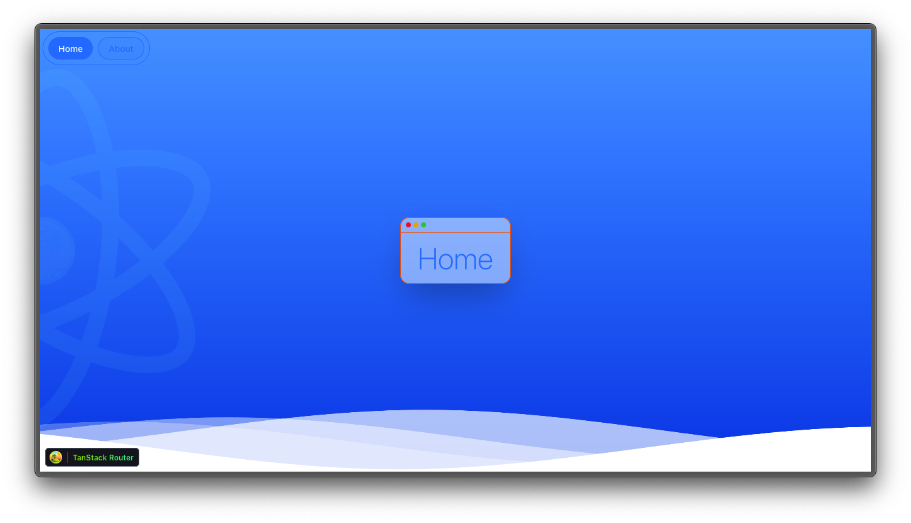

# Bareminimum ReactJS using Bun + Vite



**Bareminimum ReactJS** adalah boilerplate minimalis untuk memulai pengembangan aplikasi web menggunakan ReactJS dengan konfigurasi modern dan efisien.

---

**Bareminimum ReactJS** is a minimal boilerplate to kickstart web application development using ReactJS with modern and efficient configurations.

---

**Bareminimum ReactJS**는 ReactJS를 사용하여 현대적이고 효율적인 설정으로 웹 애플리케이션 개발을 시작하기 위한 최소한의 보일러플레이트입니다.

---

## 🛠️ Teknologi yang Digunakan | Tech Stack | 사용된 기술

- **ReactJS**: Library untuk membangun antarmuka pengguna yang dinamis.  
  A library for building dynamic user interfaces.  
  동적인 사용자 인터페이스를 구축하기 위한 라이브러리.
- **TypeScript**: Menambahkan tipe statis untuk JavaScript agar lebih aman dan terstruktur.  
  Adds static typing to JavaScript for better safety and structure.  
  JavaScript에 정적 타이핑을 추가하여 더 안전하고 구조적으로 만듭니다.
- **ESLint**: Menjaga kualitas kode dengan linting otomatis.  
  Maintains code quality with automatic linting.  
  자동 린팅으로 코드 품질을 유지합니다.
- **Jest**: Framework untuk pengujian unit dan integrasi.  
  A framework for unit and integration testing.  
  단위 및 통합 테스트를 위한 프레임워크.
- **Bun**: Runtime modern untuk JavaScript yang cepat dan ringan.  
  A modern runtime for JavaScript that is fast and lightweight.  
  빠르고 가벼운 JavaScript의 현대적인 런타임.
- **TSUP**: Bundler untuk TypeScript yang cepat dan sederhana.  
  A fast and simple bundler for TypeScript.  
  빠르고 간단한 TypeScript 번들러.

---

### Struktur | Structure | 구조

```bash
.
├── __test__
│   └── dummy.test.ts
├── public
│   ├── favicon.ico
│   ├── logo.svg
│   ├── logo192.png
│   ├── logo512.png
│   ├── manifest.json
│   └── robots.txt
├── src
│   ├── components
│   │   ├── layout
│   │   ├── misc
│   │   └── ui
│   ├── lib
│   │   └── utils.ts
│   ├── routes
│   │   ├── __root.tsx
│   │   ├── about.tsx
│   │   └── index.tsx
│   ├── styles
│   │   ├── app.css
│   │   └── waves.css
│   ├── main.tsx
│   ├── reportWebVitals.ts
│   └── routeTree.gen.ts
├── CHANGELOG.md
├── README.md
├── commitlint.config.js
├── components.json
├── eslint.config.ts
├── homepage.png
├── index.html
├── package.json
├── tsconfig.json
├── vite.config.ts
└── vitest.config.ts
```

---

## 🚀 Cara Memulai | Getting Started | 시작하는 방법

### Indonesia

1. Clone repository ini:

```bash
git clone https://github.com/your-username/bareminimum-reactjs.git
cd bareminimum-reactjs
```

2. Install dependencies:

```bash
bun install
```

3. Jalankan aplikasi:

```bash
bun run dev
```

4. Buka browser dan akses `http://localhost:3000`.

---

### English

1. Clone this repository:

```bash
git clone https://github.com/your-username/bareminimum-reactjs.git
cd bareminimum-reactjs
```

2. Install dependencies:

```bash
bun install
```

3. Run the application:

```bash
bun run dev
```

4. Open your browser and navigate to `http://localhost:3000`.

---

### 한국어

1. 이 저장소를 클론합니다:

```bash
git clone https://github.com/your-username/bareminimum-reactjs.git
cd bareminimum-reactjs
```

2. 의존성을 설치합니다:

```bash
bun install
```

3. 애플리케이션을 실행합니다:

```bash
bun run dev
```

---

### 🧪 Pengujian | Testing | 테스트

```bash
bun run test
```

---

### 🤝 Kontribusi | Contributing | 기여

> Kontribusi sangat diterima! Silakan fork repository ini dan ajukan pull request.

> Contributions are welcome! Feel free to fork this repository and submit a pull request.

> 기여는 언제나 환영입니다! 이 저장소를 포크하고 풀 리퀘스트를 제출하세요.

---

Selamat ngoding! 🚀 | Happy coding! 🚀 | 즐거운 코딩 되세요! 🚀
